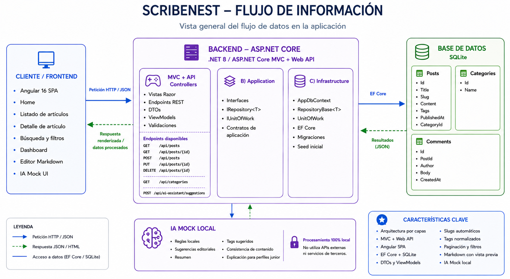
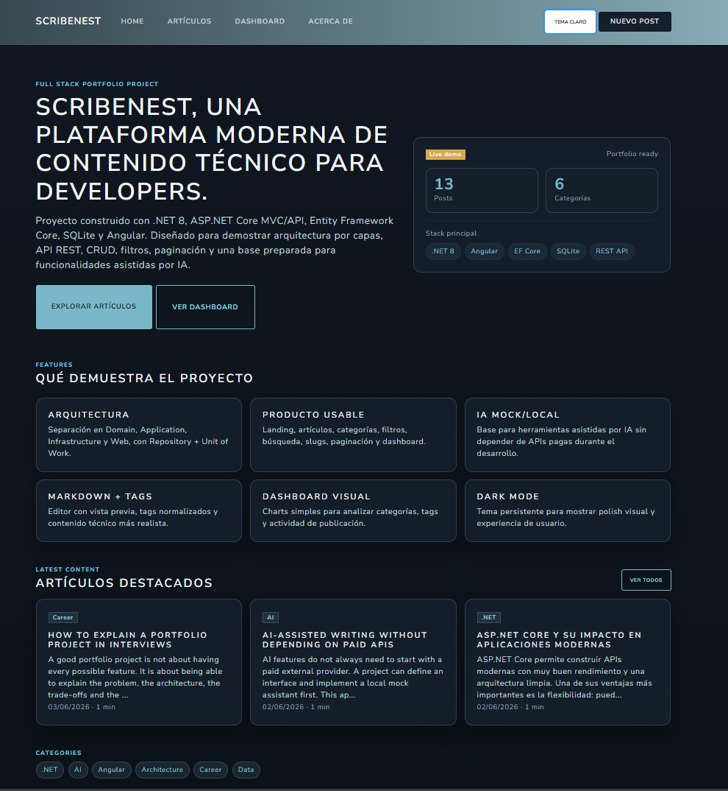
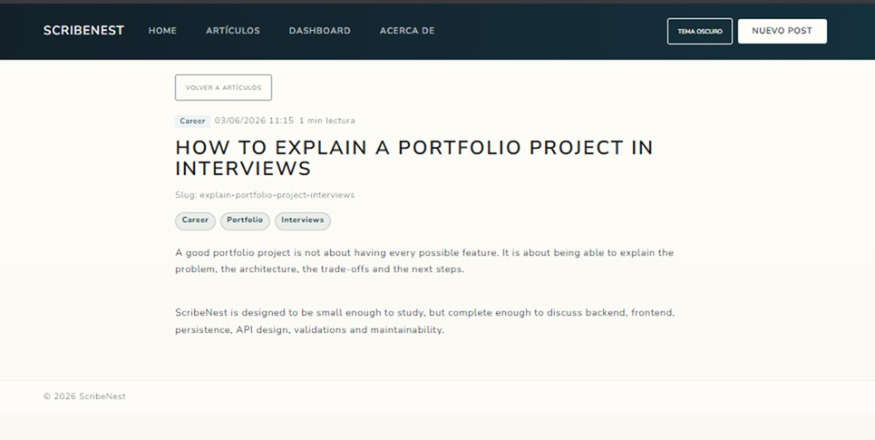
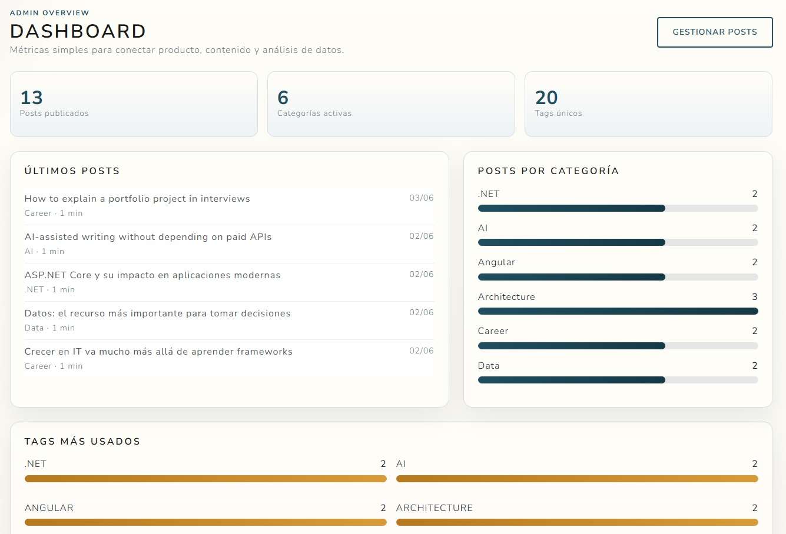
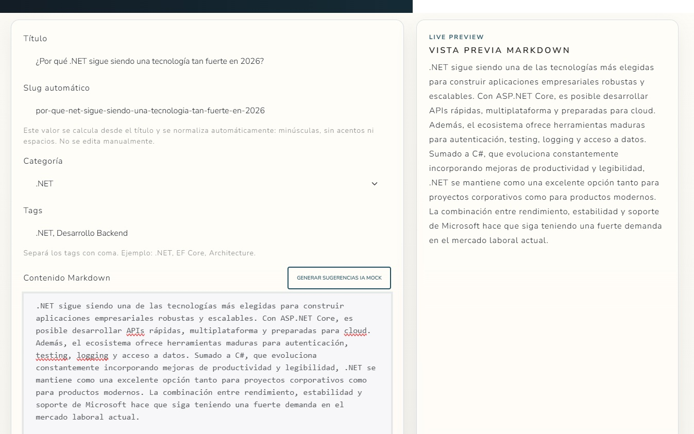
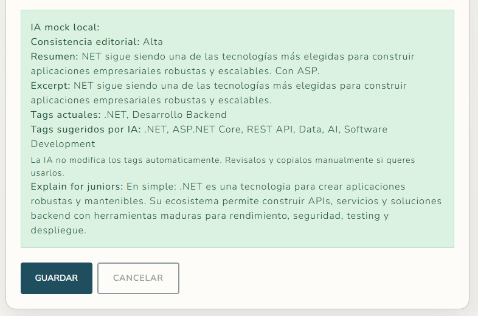

# ScribeNest

ScribeNest es una aplicación web para la gestión y publicación de artículos técnicos. Fue desarrollada como proyecto de portfolio utilizando .NET 8, ASP.NET Core MVC, Web API, Entity Framework Core, SQLite y Angular 16.

El proyecto combina una aplicación MVC funcional con una SPA en Angular que consume endpoints REST. La idea principal fue construir una aplicación de alcance acotado, pero mantenible, con separación por capas, persistencia local, dashboard, editor Markdown, slugs, tags, paginación e IA Mock sin depender de servicios externos.

## Qué problema resuelve

La aplicación permite gestionar artículos técnicos desde un panel de administración y mostrarlos en una interfaz pública.

Concretamente permite:

* Crear, editar y eliminar artículos
* Listar artículos
* Buscar por texto
* Filtrar por categoría
* Paginar resultados
* Ver el detalle de un artículo
* Generar slugs limpios a partir del título
* Clasificar artículos mediante tags
* Ver métricas simples en un dashboard
* Usar un asistente local de sugerencias editoriales

## Capturas

### Arquitectura y flujo de información


### Home


### View Post


### Dashboard


### Markdown Editor


### AI Mock


## Tecnologías utilizadas

### Backend

* .NET 8
* ASP.NET Core MVC
* ASP.NET Core Web API
* Entity Framework Core 8
* SQLite
* Razor Views
* Data Annotations
* Entity Framework Migrations
* Seed de datos inicial

### Frontend

* Angular 16
* Standalone Components
* TypeScript
* RxJS
* Angular Router
* Angular HttpClient
* Bootstrap 5 con tema Bootswatch Lux

### Arquitectura y organización

* Arquitectura por capas
* Repository Pattern
* Unit of Work
* Dependency Injection
* DTOs
* ViewModels
* Helpers para Markdown, Slugs y Tags

## Arquitectura

La solución está organizada en capas para separar responsabilidades y mantener desacoplados el dominio, la lógica de aplicación, la persistencia y la presentación.

```text
ScribeNest.Domain
ScribeNest.Application
ScribeNest.Infrastructure
ScribeNest.Web
scribenest-front
```

### ScribeNest.Domain

Contiene las entidades principales del dominio.

### ScribeNest.Application

Contiene contratos e interfaces utilizadas por la aplicación.

### ScribeNest.Infrastructure

Implementa el acceso a datos mediante Entity Framework Core, repositorios y Unit of Work.

### ScribeNest.Web

Contiene la aplicación ASP.NET Core MVC, la API REST, ViewModels, DTOs, vistas y configuración general.

### scribenest-front

Aplicación Angular encargada de consumir la API REST y ofrecer una experiencia SPA.

## Funcionalidades principales

### Gestión de artículos

* Alta, modificación y eliminación de artículos.
* Asociación de categorías.
* Asociación de tags.
* Generación automática de slugs.
* Búsqueda y filtrado.
* Paginación.

### Dashboard

* Total de artículos.
* Total de categorías.
* Estadísticas generales.
* Métricas visuales.

### Markdown

* Edición de contenido en Markdown.
* Vista previa del contenido.
* Renderizado de artículos.

### IA Mock

Sistema local de asistencia editorial que permite:

* Generar sugerencias editoriales sobre título, resumen, tags y consistencia del contenido
* Evaluar categorías y tags respecto al contenido
* Generar observaciones editoriales
* Generar explicaciones orientadas a perfiles junior

La implementación es completamente local y no utiliza APIs externas.

### Dark Mode

* Tema claro y oscuro.
* Persistencia de preferencias del usuario.

## Base de datos

La aplicación utiliza SQLite para facilitar la ejecución local sin dependencias externas.

El proyecto incluye migraciones de Entity Framework Core y un proceso de seed que carga datos iniciales para poder utilizar la aplicación inmediatamente después de ejecutarla.

## Cómo ejecutar el proyecto

### Backend

```bash
cd src/ScribeNest.Web
dotnet restore
dotnet run
```

### Frontend

```bash
cd src/scribenest-front
npm install
npm start
```
